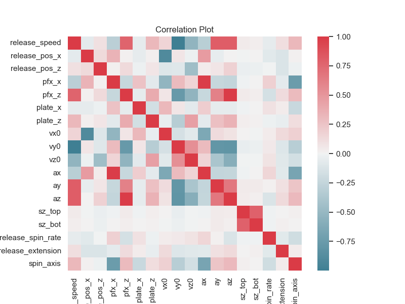
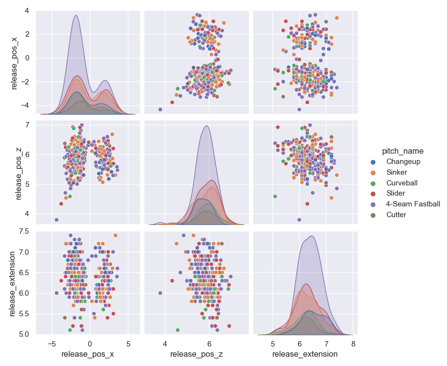
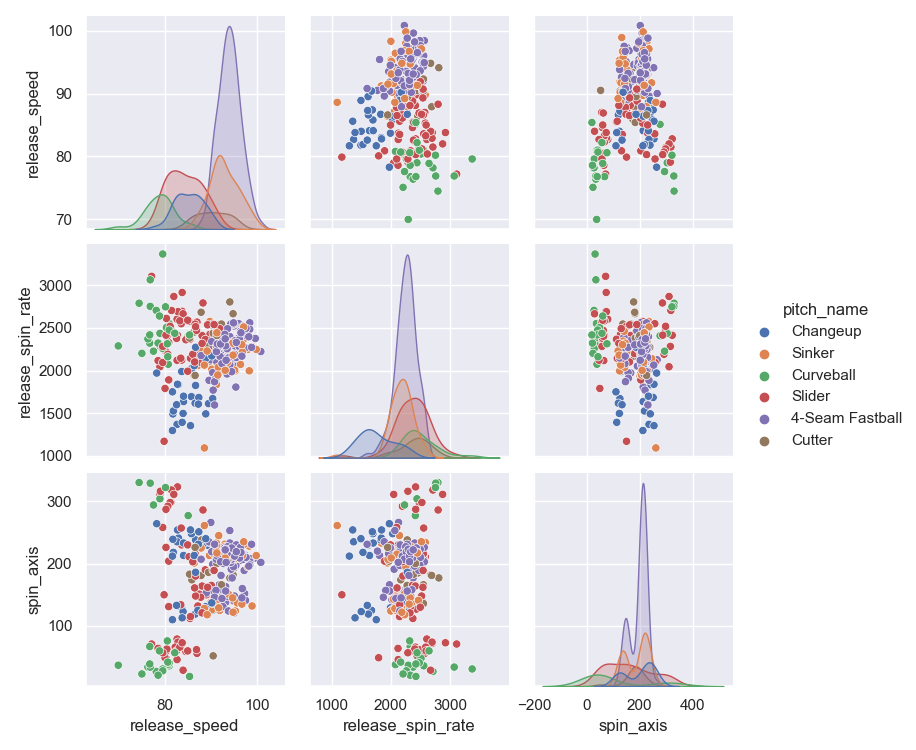
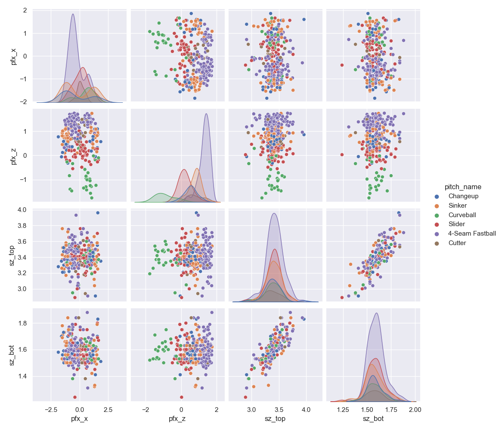
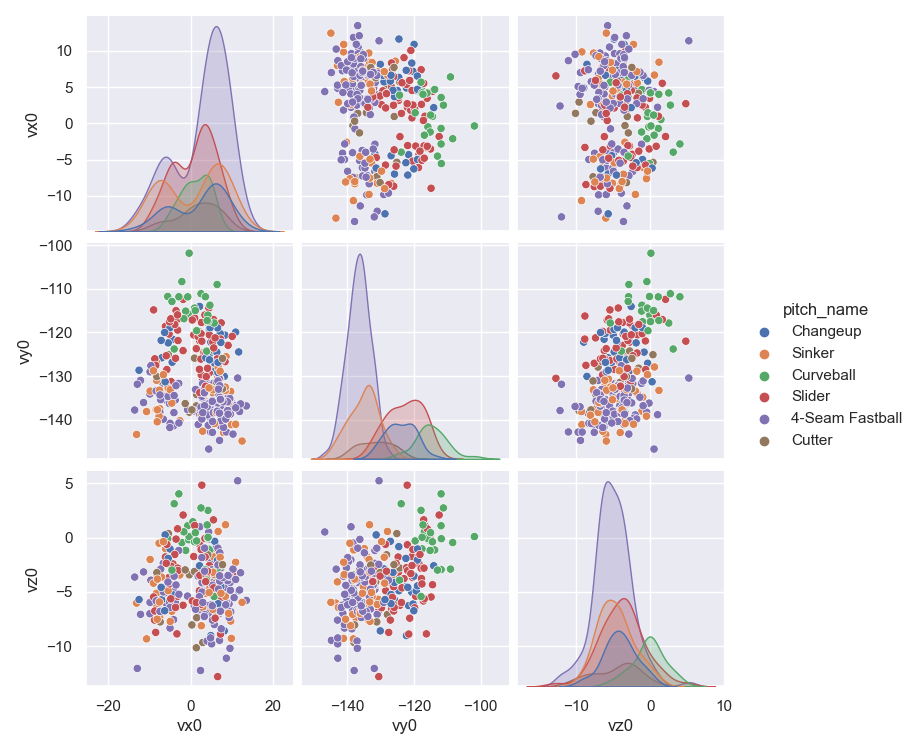
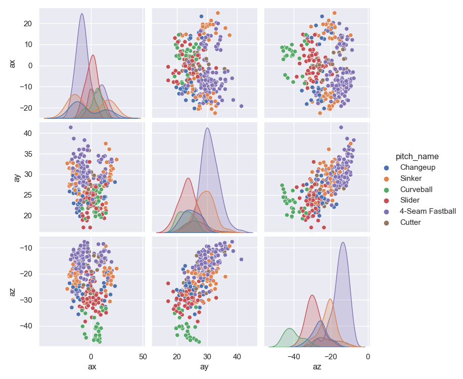

# Pitch Guesser

## Random Forest
***
### Base
***
#### Class Report
<table border="1" class="dataframe outtbl CR">
  <thead>
    <tr style="text-align: right;">
      <th></th>
      <th>precision</th>
      <th>recall</th>
      <th>f1-score</th>
      <th>support</th>
    </tr>
  </thead>
  <tbody>
    <tr>
      <th>0</th>
      <td>0.979678</td>
      <td>0.964445</td>
      <td>0.972002</td>
      <td>10097.000000</td>
    </tr>
    <tr>
      <th>1</th>
      <td>0.985323</td>
      <td>0.987510</td>
      <td>0.986415</td>
      <td>3603.000000</td>
    </tr>
    <tr>
      <th>2</th>
      <td>0.980793</td>
      <td>0.941915</td>
      <td>0.960961</td>
      <td>2548.000000</td>
    </tr>
    <tr>
      <th>3</th>
      <td>0.925503</td>
      <td>0.882322</td>
      <td>0.903397</td>
      <td>1929.000000</td>
    </tr>
    <tr>
      <th>4</th>
      <td>0.937149</td>
      <td>0.961563</td>
      <td>0.949199</td>
      <td>4683.000000</td>
    </tr>
    <tr>
      <th>5</th>
      <td>0.947618</td>
      <td>0.981478</td>
      <td>0.964251</td>
      <td>6101.000000</td>
    </tr>
    <tr>
      <th>accuracy</th>
      <td>0.962985</td>
      <td>0.962985</td>
      <td>0.962985</td>
      <td>0.962985</td>
    </tr>
    <tr>
      <th>macro avg</th>
      <td>0.959344</td>
      <td>0.953206</td>
      <td>0.956038</td>
      <td>28961.000000</td>
    </tr>
    <tr>
      <th>weighted avg</th>
      <td>0.963239</td>
      <td>0.962985</td>
      <td>0.962934</td>
      <td>28961.000000</td>
    </tr>
  </tbody>
</table>

#### Confusion Matrix
<table border="1" class="dataframe outtbl CM">
  <thead>
    <tr style="text-align: right;">
      <th></th>
      <th>4-Seam Fastball</th>
      <th>Changeup</th>
      <th>Curveball</th>
      <th>Cutter</th>
      <th>Sinker</th>
      <th>Slider</th>
    </tr>
  </thead>
  <tbody>
    <tr>
      <th>4-Seam Fastball</th>
      <td>9738</td>
      <td>9</td>
      <td>0</td>
      <td>74</td>
      <td>267</td>
      <td>9</td>
    </tr>
    <tr>
      <th>Changeup</th>
      <td>4</td>
      <td>3558</td>
      <td>0</td>
      <td>1</td>
      <td>33</td>
      <td>7</td>
    </tr>
    <tr>
      <th>Curveball</th>
      <td>0</td>
      <td>1</td>
      <td>2400</td>
      <td>0</td>
      <td>0</td>
      <td>147</td>
    </tr>
    <tr>
      <th>Cutter</th>
      <td>52</td>
      <td>2</td>
      <td>3</td>
      <td>1702</td>
      <td>2</td>
      <td>168</td>
    </tr>
    <tr>
      <th>Sinker</th>
      <td>146</td>
      <td>32</td>
      <td>0</td>
      <td>2</td>
      <td>4503</td>
      <td>0</td>
    </tr>
    <tr>
      <th>Slider</th>
      <td>0</td>
      <td>9</td>
      <td>44</td>
      <td>60</td>
      <td>0</td>
      <td>5988</td>
    </tr>
  </tbody>
</table>

### Scaled
***
#### Class Report
<table border="1" class="dataframe outtbl CR">
  <thead>
    <tr style="text-align: right;">
      <th></th>
      <th>precision</th>
      <th>recall</th>
      <th>f1-score</th>
      <th>support</th>
    </tr>
  </thead>
  <tbody>
    <tr>
      <th>0</th>
      <td>0.978116</td>
      <td>0.960582</td>
      <td>0.969270</td>
      <td>10097.000000</td>
    </tr>
    <tr>
      <th>1</th>
      <td>0.983084</td>
      <td>0.983902</td>
      <td>0.983493</td>
      <td>3603.000000</td>
    </tr>
    <tr>
      <th>2</th>
      <td>0.979150</td>
      <td>0.939953</td>
      <td>0.959151</td>
      <td>2548.000000</td>
    </tr>
    <tr>
      <th>3</th>
      <td>0.920282</td>
      <td>0.879730</td>
      <td>0.899549</td>
      <td>1929.000000</td>
    </tr>
    <tr>
      <th>4</th>
      <td>0.928275</td>
      <td>0.956225</td>
      <td>0.942043</td>
      <td>4683.000000</td>
    </tr>
    <tr>
      <th>5</th>
      <td>0.946245</td>
      <td>0.980987</td>
      <td>0.963303</td>
      <td>6101.000000</td>
    </tr>
    <tr>
      <th>accuracy</th>
      <td>0.959877</td>
      <td>0.959877</td>
      <td>0.959877</td>
      <td>0.959877</td>
    </tr>
    <tr>
      <th>macro avg</th>
      <td>0.955859</td>
      <td>0.950230</td>
      <td>0.952801</td>
      <td>28961.000000</td>
    </tr>
    <tr>
      <th>weighted avg</th>
      <td>0.960200</td>
      <td>0.959877</td>
      <td>0.959846</td>
      <td>28961.000000</td>
    </tr>
  </tbody>
</table>

#### Confusion Matrix
<table border="1" class="dataframe outtbl CM">
  <thead>
    <tr style="text-align: right;">
      <th></th>
      <th>4-Seam Fastball</th>
      <th>Changeup</th>
      <th>Curveball</th>
      <th>Cutter</th>
      <th>Sinker</th>
      <th>Slider</th>
    </tr>
  </thead>
  <tbody>
    <tr>
      <th>4-Seam Fastball</th>
      <td>9699</td>
      <td>9</td>
      <td>0</td>
      <td>81</td>
      <td>300</td>
      <td>8</td>
    </tr>
    <tr>
      <th>Changeup</th>
      <td>3</td>
      <td>3545</td>
      <td>1</td>
      <td>2</td>
      <td>44</td>
      <td>8</td>
    </tr>
    <tr>
      <th>Curveball</th>
      <td>0</td>
      <td>1</td>
      <td>2395</td>
      <td>0</td>
      <td>0</td>
      <td>152</td>
    </tr>
    <tr>
      <th>Cutter</th>
      <td>53</td>
      <td>3</td>
      <td>3</td>
      <td>1697</td>
      <td>1</td>
      <td>172</td>
    </tr>
    <tr>
      <th>Sinker</th>
      <td>161</td>
      <td>42</td>
      <td>0</td>
      <td>2</td>
      <td>4478</td>
      <td>0</td>
    </tr>
    <tr>
      <th>Slider</th>
      <td>0</td>
      <td>6</td>
      <td>47</td>
      <td>62</td>
      <td>1</td>
      <td>5985</td>
    </tr>
  </tbody>
</table>

### Add_feature
***
#### Class Report
<table border="1" class="dataframe outtbl CR">
  <thead>
    <tr style="text-align: right;">
      <th></th>
      <th>precision</th>
      <th>recall</th>
      <th>f1-score</th>
      <th>support</th>
    </tr>
  </thead>
  <tbody>
    <tr>
      <th>0</th>
      <td>0.979756</td>
      <td>0.963454</td>
      <td>0.971537</td>
      <td>10097.000000</td>
    </tr>
    <tr>
      <th>1</th>
      <td>0.986115</td>
      <td>0.985568</td>
      <td>0.985841</td>
      <td>3603.000000</td>
    </tr>
    <tr>
      <th>2</th>
      <td>0.980049</td>
      <td>0.944662</td>
      <td>0.962030</td>
      <td>2548.000000</td>
    </tr>
    <tr>
      <th>3</th>
      <td>0.917660</td>
      <td>0.878175</td>
      <td>0.897483</td>
      <td>1929.000000</td>
    </tr>
    <tr>
      <th>4</th>
      <td>0.935229</td>
      <td>0.961990</td>
      <td>0.948421</td>
      <td>4683.000000</td>
    </tr>
    <tr>
      <th>5</th>
      <td>0.946926</td>
      <td>0.979675</td>
      <td>0.963023</td>
      <td>6101.000000</td>
    </tr>
    <tr>
      <th>accuracy</th>
      <td>0.962052</td>
      <td>0.962052</td>
      <td>0.962052</td>
      <td>0.962052</td>
    </tr>
    <tr>
      <th>macro avg</th>
      <td>0.957623</td>
      <td>0.952254</td>
      <td>0.954723</td>
      <td>28961.000000</td>
    </tr>
    <tr>
      <th>weighted avg</th>
      <td>0.962321</td>
      <td>0.962052</td>
      <td>0.962016</td>
      <td>28961.000000</td>
    </tr>
  </tbody>
</table>

#### Confusion Matrix
<table border="1" class="dataframe outtbl CM">
  <thead>
    <tr style="text-align: right;">
      <th></th>
      <th>4-Seam Fastball</th>
      <th>Changeup</th>
      <th>Curveball</th>
      <th>Cutter</th>
      <th>Sinker</th>
      <th>Slider</th>
    </tr>
  </thead>
  <tbody>
    <tr>
      <th>4-Seam Fastball</th>
      <td>9728</td>
      <td>7</td>
      <td>0</td>
      <td>78</td>
      <td>275</td>
      <td>9</td>
    </tr>
    <tr>
      <th>Changeup</th>
      <td>4</td>
      <td>3551</td>
      <td>0</td>
      <td>2</td>
      <td>35</td>
      <td>11</td>
    </tr>
    <tr>
      <th>Curveball</th>
      <td>0</td>
      <td>1</td>
      <td>2407</td>
      <td>0</td>
      <td>0</td>
      <td>140</td>
    </tr>
    <tr>
      <th>Cutter</th>
      <td>52</td>
      <td>3</td>
      <td>3</td>
      <td>1694</td>
      <td>2</td>
      <td>175</td>
    </tr>
    <tr>
      <th>Sinker</th>
      <td>145</td>
      <td>31</td>
      <td>0</td>
      <td>2</td>
      <td>4505</td>
      <td>0</td>
    </tr>
    <tr>
      <th>Slider</th>
      <td>0</td>
      <td>8</td>
      <td>46</td>
      <td>70</td>
      <td>0</td>
      <td>5977</td>
    </tr>
  </tbody>
</table>

### Preprocess
***
#### Class Report
<table border="1" class="dataframe outtbl CR">
  <thead>
    <tr style="text-align: right;">
      <th></th>
      <th>precision</th>
      <th>recall</th>
      <th>f1-score</th>
      <th>support</th>
    </tr>
  </thead>
  <tbody>
    <tr>
      <th>0</th>
      <td>0.978335</td>
      <td>0.970486</td>
      <td>0.974395</td>
      <td>10097.000000</td>
    </tr>
    <tr>
      <th>1</th>
      <td>0.985278</td>
      <td>0.984457</td>
      <td>0.984867</td>
      <td>3603.000000</td>
    </tr>
    <tr>
      <th>2</th>
      <td>0.976162</td>
      <td>0.948195</td>
      <td>0.961975</td>
      <td>2548.000000</td>
    </tr>
    <tr>
      <th>3</th>
      <td>0.935904</td>
      <td>0.893209</td>
      <td>0.914058</td>
      <td>1929.000000</td>
    </tr>
    <tr>
      <th>4</th>
      <td>0.945661</td>
      <td>0.958787</td>
      <td>0.952179</td>
      <td>4683.000000</td>
    </tr>
    <tr>
      <th>5</th>
      <td>0.952555</td>
      <td>0.980659</td>
      <td>0.966403</td>
      <td>6101.000000</td>
    </tr>
    <tr>
      <th>accuracy</th>
      <td>0.965367</td>
      <td>0.965367</td>
      <td>0.965367</td>
      <td>0.965367</td>
    </tr>
    <tr>
      <th>macro avg</th>
      <td>0.962316</td>
      <td>0.955966</td>
      <td>0.958980</td>
      <td>28961.000000</td>
    </tr>
    <tr>
      <th>weighted avg</th>
      <td>0.965467</td>
      <td>0.965367</td>
      <td>0.965310</td>
      <td>28961.000000</td>
    </tr>
  </tbody>
</table>

#### Confusion Matrix
<table border="1" class="dataframe outtbl CM">
  <thead>
    <tr style="text-align: right;">
      <th></th>
      <th>4-Seam Fastball</th>
      <th>Changeup</th>
      <th>Curveball</th>
      <th>Cutter</th>
      <th>Sinker</th>
      <th>Slider</th>
    </tr>
  </thead>
  <tbody>
    <tr>
      <th>4-Seam Fastball</th>
      <td>9799</td>
      <td>10</td>
      <td>0</td>
      <td>65</td>
      <td>216</td>
      <td>7</td>
    </tr>
    <tr>
      <th>Changeup</th>
      <td>2</td>
      <td>3547</td>
      <td>0</td>
      <td>4</td>
      <td>40</td>
      <td>10</td>
    </tr>
    <tr>
      <th>Curveball</th>
      <td>0</td>
      <td>1</td>
      <td>2416</td>
      <td>0</td>
      <td>0</td>
      <td>131</td>
    </tr>
    <tr>
      <th>Cutter</th>
      <td>51</td>
      <td>1</td>
      <td>2</td>
      <td>1723</td>
      <td>2</td>
      <td>150</td>
    </tr>
    <tr>
      <th>Sinker</th>
      <td>160</td>
      <td>33</td>
      <td>0</td>
      <td>0</td>
      <td>4490</td>
      <td>0</td>
    </tr>
    <tr>
      <th>Slider</th>
      <td>4</td>
      <td>8</td>
      <td>57</td>
      <td>49</td>
      <td>0</td>
      <td>5983</td>
    </tr>
  </tbody>
</table>

### Transform
***
#### Class Report
<table border="1" class="dataframe outtbl CR">
  <thead>
    <tr style="text-align: right;">
      <th></th>
      <th>precision</th>
      <th>recall</th>
      <th>f1-score</th>
      <th>support</th>
    </tr>
  </thead>
  <tbody>
    <tr>
      <th>0</th>
      <td>0.905108</td>
      <td>0.949391</td>
      <td>0.926721</td>
      <td>10097.000000</td>
    </tr>
    <tr>
      <th>1</th>
      <td>0.925502</td>
      <td>0.920622</td>
      <td>0.923056</td>
      <td>3603.000000</td>
    </tr>
    <tr>
      <th>2</th>
      <td>0.897676</td>
      <td>0.788462</td>
      <td>0.839532</td>
      <td>2548.000000</td>
    </tr>
    <tr>
      <th>3</th>
      <td>0.732367</td>
      <td>0.575946</td>
      <td>0.644806</td>
      <td>1929.000000</td>
    </tr>
    <tr>
      <th>4</th>
      <td>0.861903</td>
      <td>0.800982</td>
      <td>0.830327</td>
      <td>4683.000000</td>
    </tr>
    <tr>
      <th>5</th>
      <td>0.826471</td>
      <td>0.904770</td>
      <td>0.863850</td>
      <td>6101.000000</td>
    </tr>
    <tr>
      <th>accuracy</th>
      <td>0.873381</td>
      <td>0.873381</td>
      <td>0.873381</td>
      <td>0.873381</td>
    </tr>
    <tr>
      <th>macro avg</th>
      <td>0.858171</td>
      <td>0.823362</td>
      <td>0.838048</td>
      <td>28961.000000</td>
    </tr>
    <tr>
      <th>weighted avg</th>
      <td>0.871933</td>
      <td>0.873381</td>
      <td>0.870985</td>
      <td>28961.000000</td>
    </tr>
  </tbody>
</table>

#### Confusion Matrix
<table border="1" class="dataframe outtbl CM">
  <thead>
    <tr style="text-align: right;">
      <th></th>
      <th>4-Seam Fastball</th>
      <th>Changeup</th>
      <th>Curveball</th>
      <th>Cutter</th>
      <th>Sinker</th>
      <th>Slider</th>
    </tr>
  </thead>
  <tbody>
    <tr>
      <th>4-Seam Fastball</th>
      <td>9586</td>
      <td>26</td>
      <td>0</td>
      <td>93</td>
      <td>374</td>
      <td>18</td>
    </tr>
    <tr>
      <th>Changeup</th>
      <td>30</td>
      <td>3317</td>
      <td>4</td>
      <td>9</td>
      <td>203</td>
      <td>40</td>
    </tr>
    <tr>
      <th>Curveball</th>
      <td>0</td>
      <td>9</td>
      <td>2009</td>
      <td>0</td>
      <td>0</td>
      <td>530</td>
    </tr>
    <tr>
      <th>Cutter</th>
      <td>216</td>
      <td>19</td>
      <td>8</td>
      <td>1111</td>
      <td>10</td>
      <td>565</td>
    </tr>
    <tr>
      <th>Sinker</th>
      <td>744</td>
      <td>174</td>
      <td>0</td>
      <td>8</td>
      <td>3751</td>
      <td>6</td>
    </tr>
    <tr>
      <th>Slider</th>
      <td>15</td>
      <td>39</td>
      <td>217</td>
      <td>296</td>
      <td>14</td>
      <td>5520</td>
    </tr>
  </tbody>
</table>

### Noise
***
#### Class Report
<table border="1" class="dataframe outtbl CR">
  <thead>
    <tr style="text-align: right;">
      <th></th>
      <th>precision</th>
      <th>recall</th>
      <th>f1-score</th>
      <th>support</th>
    </tr>
  </thead>
  <tbody>
    <tr>
      <th>0</th>
      <td>0.980319</td>
      <td>0.966921</td>
      <td>0.973574</td>
      <td>10097.000000</td>
    </tr>
    <tr>
      <th>1</th>
      <td>0.983647</td>
      <td>0.985012</td>
      <td>0.984329</td>
      <td>3603.000000</td>
    </tr>
    <tr>
      <th>2</th>
      <td>0.977823</td>
      <td>0.951727</td>
      <td>0.964598</td>
      <td>2548.000000</td>
    </tr>
    <tr>
      <th>3</th>
      <td>0.928341</td>
      <td>0.893209</td>
      <td>0.910436</td>
      <td>1929.000000</td>
    </tr>
    <tr>
      <th>4</th>
      <td>0.940648</td>
      <td>0.961136</td>
      <td>0.950782</td>
      <td>4683.000000</td>
    </tr>
    <tr>
      <th>5</th>
      <td>0.952176</td>
      <td>0.979020</td>
      <td>0.965411</td>
      <td>6101.000000</td>
    </tr>
    <tr>
      <th>accuracy</th>
      <td>0.964539</td>
      <td>0.964539</td>
      <td>0.964539</td>
      <td>0.964539</td>
    </tr>
    <tr>
      <th>macro avg</th>
      <td>0.960492</td>
      <td>0.956171</td>
      <td>0.958188</td>
      <td>28961.000000</td>
    </tr>
    <tr>
      <th>weighted avg</th>
      <td>0.964708</td>
      <td>0.964539</td>
      <td>0.964512</td>
      <td>28961.000000</td>
    </tr>
  </tbody>
</table>

#### Confusion Matrix
<table border="1" class="dataframe outtbl CM">
  <thead>
    <tr style="text-align: right;">
      <th></th>
      <th>4-Seam Fastball</th>
      <th>Changeup</th>
      <th>Curveball</th>
      <th>Cutter</th>
      <th>Sinker</th>
      <th>Slider</th>
    </tr>
  </thead>
  <tbody>
    <tr>
      <th>4-Seam Fastball</th>
      <td>9763</td>
      <td>10</td>
      <td>0</td>
      <td>72</td>
      <td>244</td>
      <td>8</td>
    </tr>
    <tr>
      <th>Changeup</th>
      <td>3</td>
      <td>3549</td>
      <td>1</td>
      <td>3</td>
      <td>37</td>
      <td>10</td>
    </tr>
    <tr>
      <th>Curveball</th>
      <td>0</td>
      <td>1</td>
      <td>2425</td>
      <td>0</td>
      <td>0</td>
      <td>122</td>
    </tr>
    <tr>
      <th>Cutter</th>
      <td>38</td>
      <td>5</td>
      <td>2</td>
      <td>1723</td>
      <td>1</td>
      <td>160</td>
    </tr>
    <tr>
      <th>Sinker</th>
      <td>150</td>
      <td>31</td>
      <td>0</td>
      <td>1</td>
      <td>4501</td>
      <td>0</td>
    </tr>
    <tr>
      <th>Slider</th>
      <td>5</td>
      <td>12</td>
      <td>52</td>
      <td>57</td>
      <td>2</td>
      <td>5973</td>
    </tr>
  </tbody>
</table>

## K-Nearest Neighbor
***
### Base
***
#### Class Report
<table border="1" class="dataframe outtbl CR">
  <thead>
    <tr style="text-align: right;">
      <th></th>
      <th>precision</th>
      <th>recall</th>
      <th>f1-score</th>
      <th>support</th>
    </tr>
  </thead>
  <tbody>
    <tr>
      <th>0</th>
      <td>0.963379</td>
      <td>0.935327</td>
      <td>0.949146</td>
      <td>10097.000000</td>
    </tr>
    <tr>
      <th>1</th>
      <td>0.958904</td>
      <td>0.971413</td>
      <td>0.965118</td>
      <td>3603.000000</td>
    </tr>
    <tr>
      <th>2</th>
      <td>0.930168</td>
      <td>0.914835</td>
      <td>0.922438</td>
      <td>2548.000000</td>
    </tr>
    <tr>
      <th>3</th>
      <td>0.851506</td>
      <td>0.850181</td>
      <td>0.850843</td>
      <td>1929.000000</td>
    </tr>
    <tr>
      <th>4</th>
      <td>0.900888</td>
      <td>0.931668</td>
      <td>0.916019</td>
      <td>4683.000000</td>
    </tr>
    <tr>
      <th>5</th>
      <td>0.924434</td>
      <td>0.944435</td>
      <td>0.934328</td>
      <td>6101.000000</td>
    </tr>
    <tr>
      <th>accuracy</th>
      <td>0.933669</td>
      <td>0.933669</td>
      <td>0.933669</td>
      <td>0.933669</td>
    </tr>
    <tr>
      <th>macro avg</th>
      <td>0.921546</td>
      <td>0.924643</td>
      <td>0.922982</td>
      <td>28961.000000</td>
    </tr>
    <tr>
      <th>weighted avg</th>
      <td>0.934140</td>
      <td>0.933669</td>
      <td>0.933757</td>
      <td>28961.000000</td>
    </tr>
  </tbody>
</table>

#### Confusion Matrix
<table border="1" class="dataframe outtbl CM">
  <thead>
    <tr style="text-align: right;">
      <th></th>
      <th>4-Seam Fastball</th>
      <th>Changeup</th>
      <th>Curveball</th>
      <th>Cutter</th>
      <th>Sinker</th>
      <th>Slider</th>
    </tr>
  </thead>
  <tbody>
    <tr>
      <th>4-Seam Fastball</th>
      <td>9444</td>
      <td>59</td>
      <td>1</td>
      <td>138</td>
      <td>419</td>
      <td>36</td>
    </tr>
    <tr>
      <th>Changeup</th>
      <td>13</td>
      <td>3500</td>
      <td>3</td>
      <td>5</td>
      <td>58</td>
      <td>24</td>
    </tr>
    <tr>
      <th>Curveball</th>
      <td>0</td>
      <td>6</td>
      <td>2331</td>
      <td>1</td>
      <td>0</td>
      <td>210</td>
    </tr>
    <tr>
      <th>Cutter</th>
      <td>81</td>
      <td>3</td>
      <td>8</td>
      <td>1640</td>
      <td>1</td>
      <td>196</td>
    </tr>
    <tr>
      <th>Sinker</th>
      <td>257</td>
      <td>56</td>
      <td>0</td>
      <td>2</td>
      <td>4363</td>
      <td>5</td>
    </tr>
    <tr>
      <th>Slider</th>
      <td>8</td>
      <td>26</td>
      <td>163</td>
      <td>140</td>
      <td>2</td>
      <td>5762</td>
    </tr>
  </tbody>
</table>

### Scaled
***
#### Class Report
<table border="1" class="dataframe outtbl CR">
  <thead>
    <tr style="text-align: right;">
      <th></th>
      <th>precision</th>
      <th>recall</th>
      <th>f1-score</th>
      <th>support</th>
    </tr>
  </thead>
  <tbody>
    <tr>
      <th>0</th>
      <td>0.714462</td>
      <td>0.860156</td>
      <td>0.780569</td>
      <td>10097.000000</td>
    </tr>
    <tr>
      <th>1</th>
      <td>0.660606</td>
      <td>0.786567</td>
      <td>0.718105</td>
      <td>3603.000000</td>
    </tr>
    <tr>
      <th>2</th>
      <td>0.758246</td>
      <td>0.712716</td>
      <td>0.734776</td>
      <td>2548.000000</td>
    </tr>
    <tr>
      <th>3</th>
      <td>0.441116</td>
      <td>0.335925</td>
      <td>0.381401</td>
      <td>1929.000000</td>
    </tr>
    <tr>
      <th>4</th>
      <td>0.586729</td>
      <td>0.322870</td>
      <td>0.416529</td>
      <td>4683.000000</td>
    </tr>
    <tr>
      <th>5</th>
      <td>0.676819</td>
      <td>0.673824</td>
      <td>0.675318</td>
      <td>6101.000000</td>
    </tr>
    <tr>
      <th>accuracy</th>
      <td>0.676979</td>
      <td>0.676979</td>
      <td>0.676979</td>
      <td>0.676979</td>
    </tr>
    <tr>
      <th>macro avg</th>
      <td>0.639663</td>
      <td>0.615343</td>
      <td>0.617783</td>
      <td>28961.000000</td>
    </tr>
    <tr>
      <th>weighted avg</th>
      <td>0.664823</td>
      <td>0.676979</td>
      <td>0.661144</td>
      <td>28961.000000</td>
    </tr>
  </tbody>
</table>

#### Confusion Matrix
<table border="1" class="dataframe outtbl CM">
  <thead>
    <tr style="text-align: right;">
      <th></th>
      <th>4-Seam Fastball</th>
      <th>Changeup</th>
      <th>Curveball</th>
      <th>Cutter</th>
      <th>Sinker</th>
      <th>Slider</th>
    </tr>
  </thead>
  <tbody>
    <tr>
      <th>4-Seam Fastball</th>
      <td>8685</td>
      <td>138</td>
      <td>4</td>
      <td>298</td>
      <td>828</td>
      <td>144</td>
    </tr>
    <tr>
      <th>Changeup</th>
      <td>88</td>
      <td>2834</td>
      <td>16</td>
      <td>39</td>
      <td>139</td>
      <td>487</td>
    </tr>
    <tr>
      <th>Curveball</th>
      <td>1</td>
      <td>47</td>
      <td>1816</td>
      <td>0</td>
      <td>0</td>
      <td>684</td>
    </tr>
    <tr>
      <th>Cutter</th>
      <td>546</td>
      <td>196</td>
      <td>10</td>
      <td>648</td>
      <td>41</td>
      <td>488</td>
    </tr>
    <tr>
      <th>Sinker</th>
      <td>2668</td>
      <td>268</td>
      <td>1</td>
      <td>74</td>
      <td>1512</td>
      <td>160</td>
    </tr>
    <tr>
      <th>Slider</th>
      <td>168</td>
      <td>807</td>
      <td>548</td>
      <td>410</td>
      <td>57</td>
      <td>4111</td>
    </tr>
  </tbody>
</table>

### Add_feature
***
#### Class Report
<table border="1" class="dataframe outtbl CR">
  <thead>
    <tr style="text-align: right;">
      <th></th>
      <th>precision</th>
      <th>recall</th>
      <th>f1-score</th>
      <th>support</th>
    </tr>
  </thead>
  <tbody>
    <tr>
      <th>0</th>
      <td>0.963248</td>
      <td>0.942260</td>
      <td>0.952638</td>
      <td>10097.000000</td>
    </tr>
    <tr>
      <th>1</th>
      <td>0.955428</td>
      <td>0.969747</td>
      <td>0.962534</td>
      <td>3603.000000</td>
    </tr>
    <tr>
      <th>2</th>
      <td>0.936897</td>
      <td>0.914835</td>
      <td>0.925735</td>
      <td>2548.000000</td>
    </tr>
    <tr>
      <th>3</th>
      <td>0.873262</td>
      <td>0.846553</td>
      <td>0.859700</td>
      <td>1929.000000</td>
    </tr>
    <tr>
      <th>4</th>
      <td>0.911102</td>
      <td>0.932308</td>
      <td>0.921583</td>
      <td>4683.000000</td>
    </tr>
    <tr>
      <th>5</th>
      <td>0.922574</td>
      <td>0.949189</td>
      <td>0.935692</td>
      <td>6101.000000</td>
    </tr>
    <tr>
      <th>accuracy</th>
      <td>0.936743</td>
      <td>0.936743</td>
      <td>0.936743</td>
      <td>0.936743</td>
    </tr>
    <tr>
      <th>macro avg</th>
      <td>0.927085</td>
      <td>0.925815</td>
      <td>0.926314</td>
      <td>28961.000000</td>
    </tr>
    <tr>
      <th>weighted avg</th>
      <td>0.936963</td>
      <td>0.936743</td>
      <td>0.936721</td>
      <td>28961.000000</td>
    </tr>
  </tbody>
</table>

#### Confusion Matrix
<table border="1" class="dataframe outtbl CM">
  <thead>
    <tr style="text-align: right;">
      <th></th>
      <th>4-Seam Fastball</th>
      <th>Changeup</th>
      <th>Curveball</th>
      <th>Cutter</th>
      <th>Sinker</th>
      <th>Slider</th>
    </tr>
  </thead>
  <tbody>
    <tr>
      <th>4-Seam Fastball</th>
      <td>9514</td>
      <td>71</td>
      <td>1</td>
      <td>104</td>
      <td>363</td>
      <td>44</td>
    </tr>
    <tr>
      <th>Changeup</th>
      <td>16</td>
      <td>3494</td>
      <td>3</td>
      <td>4</td>
      <td>60</td>
      <td>26</td>
    </tr>
    <tr>
      <th>Curveball</th>
      <td>0</td>
      <td>7</td>
      <td>2331</td>
      <td>0</td>
      <td>0</td>
      <td>210</td>
    </tr>
    <tr>
      <th>Cutter</th>
      <td>80</td>
      <td>4</td>
      <td>9</td>
      <td>1633</td>
      <td>2</td>
      <td>201</td>
    </tr>
    <tr>
      <th>Sinker</th>
      <td>260</td>
      <td>50</td>
      <td>0</td>
      <td>2</td>
      <td>4366</td>
      <td>5</td>
    </tr>
    <tr>
      <th>Slider</th>
      <td>7</td>
      <td>31</td>
      <td>144</td>
      <td>127</td>
      <td>1</td>
      <td>5791</td>
    </tr>
  </tbody>
</table>

### Preprocess
***
#### Class Report
<table border="1" class="dataframe outtbl CR">
  <thead>
    <tr style="text-align: right;">
      <th></th>
      <th>precision</th>
      <th>recall</th>
      <th>f1-score</th>
      <th>support</th>
    </tr>
  </thead>
  <tbody>
    <tr>
      <th>0</th>
      <td>0.972175</td>
      <td>0.955036</td>
      <td>0.963529</td>
      <td>10097.000000</td>
    </tr>
    <tr>
      <th>1</th>
      <td>0.974073</td>
      <td>0.969747</td>
      <td>0.971905</td>
      <td>3603.000000</td>
    </tr>
    <tr>
      <th>2</th>
      <td>0.956928</td>
      <td>0.924254</td>
      <td>0.940307</td>
      <td>2548.000000</td>
    </tr>
    <tr>
      <th>3</th>
      <td>0.876422</td>
      <td>0.878694</td>
      <td>0.877556</td>
      <td>1929.000000</td>
    </tr>
    <tr>
      <th>4</th>
      <td>0.918427</td>
      <td>0.947256</td>
      <td>0.932619</td>
      <td>4683.000000</td>
    </tr>
    <tr>
      <th>5</th>
      <td>0.939486</td>
      <td>0.959351</td>
      <td>0.949315</td>
      <td>6101.000000</td>
    </tr>
    <tr>
      <th>accuracy</th>
      <td>0.948724</td>
      <td>0.948724</td>
      <td>0.948724</td>
      <td>0.948724</td>
    </tr>
    <tr>
      <th>macro avg</th>
      <td>0.939585</td>
      <td>0.939056</td>
      <td>0.939205</td>
      <td>28961.000000</td>
    </tr>
    <tr>
      <th>weighted avg</th>
      <td>0.949114</td>
      <td>0.948724</td>
      <td>0.948809</td>
      <td>28961.000000</td>
    </tr>
  </tbody>
</table>

#### Confusion Matrix
<table border="1" class="dataframe outtbl CM">
  <thead>
    <tr style="text-align: right;">
      <th></th>
      <th>4-Seam Fastball</th>
      <th>Changeup</th>
      <th>Curveball</th>
      <th>Cutter</th>
      <th>Sinker</th>
      <th>Slider</th>
    </tr>
  </thead>
  <tbody>
    <tr>
      <th>4-Seam Fastball</th>
      <td>9643</td>
      <td>17</td>
      <td>0</td>
      <td>110</td>
      <td>313</td>
      <td>14</td>
    </tr>
    <tr>
      <th>Changeup</th>
      <td>19</td>
      <td>3494</td>
      <td>0</td>
      <td>3</td>
      <td>78</td>
      <td>9</td>
    </tr>
    <tr>
      <th>Curveball</th>
      <td>0</td>
      <td>4</td>
      <td>2355</td>
      <td>1</td>
      <td>1</td>
      <td>187</td>
    </tr>
    <tr>
      <th>Cutter</th>
      <td>63</td>
      <td>3</td>
      <td>1</td>
      <td>1695</td>
      <td>2</td>
      <td>165</td>
    </tr>
    <tr>
      <th>Sinker</th>
      <td>186</td>
      <td>57</td>
      <td>0</td>
      <td>2</td>
      <td>4436</td>
      <td>2</td>
    </tr>
    <tr>
      <th>Slider</th>
      <td>8</td>
      <td>12</td>
      <td>105</td>
      <td>123</td>
      <td>0</td>
      <td>5853</td>
    </tr>
  </tbody>
</table>

### Transform
***
#### Class Report
<table border="1" class="dataframe outtbl CR">
  <thead>
    <tr style="text-align: right;">
      <th></th>
      <th>precision</th>
      <th>recall</th>
      <th>f1-score</th>
      <th>support</th>
    </tr>
  </thead>
  <tbody>
    <tr>
      <th>0</th>
      <td>0.902229</td>
      <td>0.954145</td>
      <td>0.927461</td>
      <td>10097.000000</td>
    </tr>
    <tr>
      <th>1</th>
      <td>0.942330</td>
      <td>0.920622</td>
      <td>0.931349</td>
      <td>3603.000000</td>
    </tr>
    <tr>
      <th>2</th>
      <td>0.907087</td>
      <td>0.823783</td>
      <td>0.863431</td>
      <td>2548.000000</td>
    </tr>
    <tr>
      <th>3</th>
      <td>0.751703</td>
      <td>0.629342</td>
      <td>0.685102</td>
      <td>1929.000000</td>
    </tr>
    <tr>
      <th>4</th>
      <td>0.867128</td>
      <td>0.802691</td>
      <td>0.833666</td>
      <td>4683.000000</td>
    </tr>
    <tr>
      <th>5</th>
      <td>0.849515</td>
      <td>0.904934</td>
      <td>0.876349</td>
      <td>6101.000000</td>
    </tr>
    <tr>
      <th>accuracy</th>
      <td>0.882014</td>
      <td>0.882014</td>
      <td>0.882014</td>
      <td>0.882014</td>
    </tr>
    <tr>
      <th>macro avg</th>
      <td>0.869999</td>
      <td>0.839253</td>
      <td>0.852893</td>
      <td>28961.000000</td>
    </tr>
    <tr>
      <th>weighted avg</th>
      <td>0.880839</td>
      <td>0.882014</td>
      <td>0.880234</td>
      <td>28961.000000</td>
    </tr>
  </tbody>
</table>

#### Confusion Matrix
<table border="1" class="dataframe outtbl CM">
  <thead>
    <tr style="text-align: right;">
      <th></th>
      <th>4-Seam Fastball</th>
      <th>Changeup</th>
      <th>Curveball</th>
      <th>Cutter</th>
      <th>Sinker</th>
      <th>Slider</th>
    </tr>
  </thead>
  <tbody>
    <tr>
      <th>4-Seam Fastball</th>
      <td>9634</td>
      <td>19</td>
      <td>0</td>
      <td>70</td>
      <td>352</td>
      <td>22</td>
    </tr>
    <tr>
      <th>Changeup</th>
      <td>34</td>
      <td>3317</td>
      <td>0</td>
      <td>10</td>
      <td>208</td>
      <td>34</td>
    </tr>
    <tr>
      <th>Curveball</th>
      <td>0</td>
      <td>11</td>
      <td>2099</td>
      <td>1</td>
      <td>0</td>
      <td>437</td>
    </tr>
    <tr>
      <th>Cutter</th>
      <td>205</td>
      <td>14</td>
      <td>10</td>
      <td>1214</td>
      <td>6</td>
      <td>480</td>
    </tr>
    <tr>
      <th>Sinker</th>
      <td>788</td>
      <td>120</td>
      <td>0</td>
      <td>11</td>
      <td>3759</td>
      <td>5</td>
    </tr>
    <tr>
      <th>Slider</th>
      <td>17</td>
      <td>39</td>
      <td>205</td>
      <td>309</td>
      <td>10</td>
      <td>5521</td>
    </tr>
  </tbody>
</table>

### Noise
***
#### Class Report
<table border="1" class="dataframe outtbl CR">
  <thead>
    <tr style="text-align: right;">
      <th></th>
      <th>precision</th>
      <th>recall</th>
      <th>f1-score</th>
      <th>support</th>
    </tr>
  </thead>
  <tbody>
    <tr>
      <th>0</th>
      <td>0.836744</td>
      <td>0.903041</td>
      <td>0.868629</td>
      <td>10097.000000</td>
    </tr>
    <tr>
      <th>1</th>
      <td>0.853831</td>
      <td>0.838190</td>
      <td>0.845938</td>
      <td>3603.000000</td>
    </tr>
    <tr>
      <th>2</th>
      <td>0.733968</td>
      <td>0.696232</td>
      <td>0.714602</td>
      <td>2548.000000</td>
    </tr>
    <tr>
      <th>3</th>
      <td>0.572473</td>
      <td>0.487299</td>
      <td>0.526463</td>
      <td>1929.000000</td>
    </tr>
    <tr>
      <th>4</th>
      <td>0.760135</td>
      <td>0.672646</td>
      <td>0.713719</td>
      <td>4683.000000</td>
    </tr>
    <tr>
      <th>5</th>
      <td>0.751423</td>
      <td>0.778889</td>
      <td>0.764909</td>
      <td>6101.000000</td>
    </tr>
    <tr>
      <th>accuracy</th>
      <td>0.785677</td>
      <td>0.785677</td>
      <td>0.785677</td>
      <td>0.785677</td>
    </tr>
    <tr>
      <th>macro avg</th>
      <td>0.751429</td>
      <td>0.729383</td>
      <td>0.739044</td>
      <td>28961.000000</td>
    </tr>
    <tr>
      <th>weighted avg</th>
      <td>0.781864</td>
      <td>0.785677</td>
      <td>0.782565</td>
      <td>28961.000000</td>
    </tr>
  </tbody>
</table>

#### Confusion Matrix
<table border="1" class="dataframe outtbl CM">
  <thead>
    <tr style="text-align: right;">
      <th></th>
      <th>4-Seam Fastball</th>
      <th>Changeup</th>
      <th>Curveball</th>
      <th>Cutter</th>
      <th>Sinker</th>
      <th>Slider</th>
    </tr>
  </thead>
  <tbody>
    <tr>
      <th>4-Seam Fastball</th>
      <td>9118</td>
      <td>103</td>
      <td>4</td>
      <td>180</td>
      <td>618</td>
      <td>74</td>
    </tr>
    <tr>
      <th>Changeup</th>
      <td>85</td>
      <td>3020</td>
      <td>7</td>
      <td>18</td>
      <td>343</td>
      <td>130</td>
    </tr>
    <tr>
      <th>Curveball</th>
      <td>2</td>
      <td>18</td>
      <td>1774</td>
      <td>5</td>
      <td>1</td>
      <td>748</td>
    </tr>
    <tr>
      <th>Cutter</th>
      <td>339</td>
      <td>21</td>
      <td>15</td>
      <td>940</td>
      <td>17</td>
      <td>597</td>
    </tr>
    <tr>
      <th>Sinker</th>
      <td>1258</td>
      <td>239</td>
      <td>3</td>
      <td>10</td>
      <td>3150</td>
      <td>23</td>
    </tr>
    <tr>
      <th>Slider</th>
      <td>95</td>
      <td>136</td>
      <td>614</td>
      <td>489</td>
      <td>15</td>
      <td>4752</td>
    </tr>
  </tbody>
</table>

## Gradient Boosting
***
### Base
***
#### Class Report
<table border="1" class="dataframe outtbl CR">
  <thead>
    <tr style="text-align: right;">
      <th></th>
      <th>precision</th>
      <th>recall</th>
      <th>f1-score</th>
      <th>support</th>
    </tr>
  </thead>
  <tbody>
    <tr>
      <th>0</th>
      <td>0.923500</td>
      <td>0.948103</td>
      <td>0.935640</td>
      <td>10097.000000</td>
    </tr>
    <tr>
      <th>1</th>
      <td>0.943364</td>
      <td>0.929226</td>
      <td>0.936242</td>
      <td>3603.000000</td>
    </tr>
    <tr>
      <th>2</th>
      <td>0.889764</td>
      <td>0.798273</td>
      <td>0.841539</td>
      <td>2548.000000</td>
    </tr>
    <tr>
      <th>3</th>
      <td>0.684024</td>
      <td>0.599274</td>
      <td>0.638851</td>
      <td>1929.000000</td>
    </tr>
    <tr>
      <th>4</th>
      <td>0.881026</td>
      <td>0.850737</td>
      <td>0.865617</td>
      <td>4683.000000</td>
    </tr>
    <tr>
      <th>5</th>
      <td>0.826206</td>
      <td>0.886740</td>
      <td>0.855404</td>
      <td>6101.000000</td>
    </tr>
    <tr>
      <th>accuracy</th>
      <td>0.880667</td>
      <td>0.880667</td>
      <td>0.880667</td>
      <td>0.880667</td>
    </tr>
    <tr>
      <th>macro avg</th>
      <td>0.857981</td>
      <td>0.835392</td>
      <td>0.845549</td>
      <td>28961.000000</td>
    </tr>
    <tr>
      <th>weighted avg</th>
      <td>0.879688</td>
      <td>0.880667</td>
      <td>0.879442</td>
      <td>28961.000000</td>
    </tr>
  </tbody>
</table>

#### Confusion Matrix
<table border="1" class="dataframe outtbl CM">
  <thead>
    <tr style="text-align: right;">
      <th></th>
      <th>4-Seam Fastball</th>
      <th>Changeup</th>
      <th>Curveball</th>
      <th>Cutter</th>
      <th>Sinker</th>
      <th>Slider</th>
    </tr>
  </thead>
  <tbody>
    <tr>
      <th>4-Seam Fastball</th>
      <td>9573</td>
      <td>16</td>
      <td>0</td>
      <td>129</td>
      <td>357</td>
      <td>22</td>
    </tr>
    <tr>
      <th>Changeup</th>
      <td>21</td>
      <td>3348</td>
      <td>8</td>
      <td>6</td>
      <td>170</td>
      <td>50</td>
    </tr>
    <tr>
      <th>Curveball</th>
      <td>0</td>
      <td>4</td>
      <td>2034</td>
      <td>0</td>
      <td>0</td>
      <td>510</td>
    </tr>
    <tr>
      <th>Cutter</th>
      <td>209</td>
      <td>9</td>
      <td>3</td>
      <td>1156</td>
      <td>7</td>
      <td>545</td>
    </tr>
    <tr>
      <th>Sinker</th>
      <td>552</td>
      <td>127</td>
      <td>1</td>
      <td>8</td>
      <td>3984</td>
      <td>11</td>
    </tr>
    <tr>
      <th>Slider</th>
      <td>11</td>
      <td>45</td>
      <td>240</td>
      <td>391</td>
      <td>4</td>
      <td>5410</td>
    </tr>
  </tbody>
</table>

### Scaled
***
#### Class Report
<table border="1" class="dataframe outtbl CR">
  <thead>
    <tr style="text-align: right;">
      <th></th>
      <th>precision</th>
      <th>recall</th>
      <th>f1-score</th>
      <th>support</th>
    </tr>
  </thead>
  <tbody>
    <tr>
      <th>0</th>
      <td>0.921131</td>
      <td>0.945033</td>
      <td>0.932929</td>
      <td>10097.000000</td>
    </tr>
    <tr>
      <th>1</th>
      <td>0.938873</td>
      <td>0.925062</td>
      <td>0.931917</td>
      <td>3603.000000</td>
    </tr>
    <tr>
      <th>2</th>
      <td>0.885930</td>
      <td>0.783359</td>
      <td>0.831493</td>
      <td>2548.000000</td>
    </tr>
    <tr>
      <th>3</th>
      <td>0.683735</td>
      <td>0.588388</td>
      <td>0.632488</td>
      <td>1929.000000</td>
    </tr>
    <tr>
      <th>4</th>
      <td>0.870173</td>
      <td>0.837284</td>
      <td>0.853412</td>
      <td>4683.000000</td>
    </tr>
    <tr>
      <th>5</th>
      <td>0.818634</td>
      <td>0.890018</td>
      <td>0.852835</td>
      <td>6101.000000</td>
    </tr>
    <tr>
      <th>accuracy</th>
      <td>0.875557</td>
      <td>0.875557</td>
      <td>0.875557</td>
      <td>0.875557</td>
    </tr>
    <tr>
      <th>macro avg</th>
      <td>0.853079</td>
      <td>0.828191</td>
      <td>0.839179</td>
      <td>28961.000000</td>
    </tr>
    <tr>
      <th>weighted avg</th>
      <td>0.874597</td>
      <td>0.875557</td>
      <td>0.874137</td>
      <td>28961.000000</td>
    </tr>
  </tbody>
</table>

#### Confusion Matrix
<table border="1" class="dataframe outtbl CM">
  <thead>
    <tr style="text-align: right;">
      <th></th>
      <th>4-Seam Fastball</th>
      <th>Changeup</th>
      <th>Curveball</th>
      <th>Cutter</th>
      <th>Sinker</th>
      <th>Slider</th>
    </tr>
  </thead>
  <tbody>
    <tr>
      <th>4-Seam Fastball</th>
      <td>9542</td>
      <td>12</td>
      <td>0</td>
      <td>131</td>
      <td>390</td>
      <td>22</td>
    </tr>
    <tr>
      <th>Changeup</th>
      <td>20</td>
      <td>3333</td>
      <td>11</td>
      <td>5</td>
      <td>182</td>
      <td>52</td>
    </tr>
    <tr>
      <th>Curveball</th>
      <td>0</td>
      <td>7</td>
      <td>1996</td>
      <td>0</td>
      <td>0</td>
      <td>545</td>
    </tr>
    <tr>
      <th>Cutter</th>
      <td>201</td>
      <td>9</td>
      <td>5</td>
      <td>1135</td>
      <td>6</td>
      <td>573</td>
    </tr>
    <tr>
      <th>Sinker</th>
      <td>583</td>
      <td>160</td>
      <td>1</td>
      <td>7</td>
      <td>3921</td>
      <td>11</td>
    </tr>
    <tr>
      <th>Slider</th>
      <td>13</td>
      <td>29</td>
      <td>240</td>
      <td>382</td>
      <td>7</td>
      <td>5430</td>
    </tr>
  </tbody>
</table>

### Add_feature
***
#### Class Report
<table border="1" class="dataframe outtbl CR">
  <thead>
    <tr style="text-align: right;">
      <th></th>
      <th>precision</th>
      <th>recall</th>
      <th>f1-score</th>
      <th>support</th>
    </tr>
  </thead>
  <tbody>
    <tr>
      <th>0</th>
      <td>0.922462</td>
      <td>0.948500</td>
      <td>0.935300</td>
      <td>10097.000000</td>
    </tr>
    <tr>
      <th>1</th>
      <td>0.945306</td>
      <td>0.930613</td>
      <td>0.937902</td>
      <td>3603.000000</td>
    </tr>
    <tr>
      <th>2</th>
      <td>0.894483</td>
      <td>0.801805</td>
      <td>0.845613</td>
      <td>2548.000000</td>
    </tr>
    <tr>
      <th>3</th>
      <td>0.699212</td>
      <td>0.597719</td>
      <td>0.644494</td>
      <td>1929.000000</td>
    </tr>
    <tr>
      <th>4</th>
      <td>0.882562</td>
      <td>0.847320</td>
      <td>0.864582</td>
      <td>4683.000000</td>
    </tr>
    <tr>
      <th>5</th>
      <td>0.828866</td>
      <td>0.897066</td>
      <td>0.861618</td>
      <td>6101.000000</td>
    </tr>
    <tr>
      <th>accuracy</th>
      <td>0.882808</td>
      <td>0.882808</td>
      <td>0.882808</td>
      <td>0.882808</td>
    </tr>
    <tr>
      <th>macro avg</th>
      <td>0.862148</td>
      <td>0.837171</td>
      <td>0.848251</td>
      <td>28961.000000</td>
    </tr>
    <tr>
      <th>weighted avg</th>
      <td>0.881803</td>
      <td>0.882808</td>
      <td>0.881406</td>
      <td>28961.000000</td>
    </tr>
  </tbody>
</table>

#### Confusion Matrix
<table border="1" class="dataframe outtbl CM">
  <thead>
    <tr style="text-align: right;">
      <th></th>
      <th>4-Seam Fastball</th>
      <th>Changeup</th>
      <th>Curveball</th>
      <th>Cutter</th>
      <th>Sinker</th>
      <th>Slider</th>
    </tr>
  </thead>
  <tbody>
    <tr>
      <th>4-Seam Fastball</th>
      <td>9577</td>
      <td>13</td>
      <td>0</td>
      <td>136</td>
      <td>356</td>
      <td>15</td>
    </tr>
    <tr>
      <th>Changeup</th>
      <td>19</td>
      <td>3353</td>
      <td>7</td>
      <td>3</td>
      <td>162</td>
      <td>59</td>
    </tr>
    <tr>
      <th>Curveball</th>
      <td>0</td>
      <td>4</td>
      <td>2043</td>
      <td>0</td>
      <td>0</td>
      <td>501</td>
    </tr>
    <tr>
      <th>Cutter</th>
      <td>210</td>
      <td>9</td>
      <td>3</td>
      <td>1153</td>
      <td>6</td>
      <td>548</td>
    </tr>
    <tr>
      <th>Sinker</th>
      <td>564</td>
      <td>129</td>
      <td>1</td>
      <td>14</td>
      <td>3968</td>
      <td>7</td>
    </tr>
    <tr>
      <th>Slider</th>
      <td>12</td>
      <td>39</td>
      <td>230</td>
      <td>343</td>
      <td>4</td>
      <td>5473</td>
    </tr>
  </tbody>
</table>

### Preprocess
***
#### Class Report
<table border="1" class="dataframe outtbl CR">
  <thead>
    <tr style="text-align: right;">
      <th></th>
      <th>precision</th>
      <th>recall</th>
      <th>f1-score</th>
      <th>support</th>
    </tr>
  </thead>
  <tbody>
    <tr>
      <th>0</th>
      <td>0.923456</td>
      <td>0.947509</td>
      <td>0.935328</td>
      <td>10097.000000</td>
    </tr>
    <tr>
      <th>1</th>
      <td>0.942509</td>
      <td>0.923675</td>
      <td>0.932997</td>
      <td>3603.000000</td>
    </tr>
    <tr>
      <th>2</th>
      <td>0.878696</td>
      <td>0.793171</td>
      <td>0.833746</td>
      <td>2548.000000</td>
    </tr>
    <tr>
      <th>3</th>
      <td>0.677907</td>
      <td>0.604458</td>
      <td>0.639079</td>
      <td>1929.000000</td>
    </tr>
    <tr>
      <th>4</th>
      <td>0.882156</td>
      <td>0.842409</td>
      <td>0.861824</td>
      <td>4683.000000</td>
    </tr>
    <tr>
      <th>5</th>
      <td>0.820918</td>
      <td>0.885101</td>
      <td>0.851802</td>
      <td>6101.000000</td>
    </tr>
    <tr>
      <th>accuracy</th>
      <td>0.877974</td>
      <td>0.877974</td>
      <td>0.877974</td>
      <td>0.877974</td>
    </tr>
    <tr>
      <th>macro avg</th>
      <td>0.854274</td>
      <td>0.832720</td>
      <td>0.842463</td>
      <td>28961.000000</td>
    </tr>
    <tr>
      <th>weighted avg</th>
      <td>0.877254</td>
      <td>0.877974</td>
      <td>0.876887</td>
      <td>28961.000000</td>
    </tr>
  </tbody>
</table>

#### Confusion Matrix
<table border="1" class="dataframe outtbl CM">
  <thead>
    <tr style="text-align: right;">
      <th></th>
      <th>4-Seam Fastball</th>
      <th>Changeup</th>
      <th>Curveball</th>
      <th>Cutter</th>
      <th>Sinker</th>
      <th>Slider</th>
    </tr>
  </thead>
  <tbody>
    <tr>
      <th>4-Seam Fastball</th>
      <td>9567</td>
      <td>17</td>
      <td>0</td>
      <td>157</td>
      <td>340</td>
      <td>16</td>
    </tr>
    <tr>
      <th>Changeup</th>
      <td>23</td>
      <td>3328</td>
      <td>7</td>
      <td>7</td>
      <td>175</td>
      <td>63</td>
    </tr>
    <tr>
      <th>Curveball</th>
      <td>0</td>
      <td>4</td>
      <td>2021</td>
      <td>1</td>
      <td>0</td>
      <td>522</td>
    </tr>
    <tr>
      <th>Cutter</th>
      <td>179</td>
      <td>8</td>
      <td>5</td>
      <td>1166</td>
      <td>5</td>
      <td>566</td>
    </tr>
    <tr>
      <th>Sinker</th>
      <td>579</td>
      <td>135</td>
      <td>1</td>
      <td>12</td>
      <td>3945</td>
      <td>11</td>
    </tr>
    <tr>
      <th>Slider</th>
      <td>12</td>
      <td>39</td>
      <td>266</td>
      <td>377</td>
      <td>7</td>
      <td>5400</td>
    </tr>
  </tbody>
</table>

### Transform
***
#### Class Report
<table border="1" class="dataframe outtbl CR">
  <thead>
    <tr style="text-align: right;">
      <th></th>
      <th>precision</th>
      <th>recall</th>
      <th>f1-score</th>
      <th>support</th>
    </tr>
  </thead>
  <tbody>
    <tr>
      <th>0</th>
      <td>0.885599</td>
      <td>0.933049</td>
      <td>0.908705</td>
      <td>10097.000000</td>
    </tr>
    <tr>
      <th>1</th>
      <td>0.905607</td>
      <td>0.892034</td>
      <td>0.898770</td>
      <td>3603.000000</td>
    </tr>
    <tr>
      <th>2</th>
      <td>0.833550</td>
      <td>0.754710</td>
      <td>0.792173</td>
      <td>2548.000000</td>
    </tr>
    <tr>
      <th>3</th>
      <td>0.628365</td>
      <td>0.496112</td>
      <td>0.554461</td>
      <td>1929.000000</td>
    </tr>
    <tr>
      <th>4</th>
      <td>0.823242</td>
      <td>0.754858</td>
      <td>0.787568</td>
      <td>4683.000000</td>
    </tr>
    <tr>
      <th>5</th>
      <td>0.794286</td>
      <td>0.865760</td>
      <td>0.828484</td>
      <td>6101.000000</td>
    </tr>
    <tr>
      <th>accuracy</th>
      <td>0.840164</td>
      <td>0.840164</td>
      <td>0.840164</td>
      <td>0.840164</td>
    </tr>
    <tr>
      <th>macro avg</th>
      <td>0.811775</td>
      <td>0.782754</td>
      <td>0.795027</td>
      <td>28961.000000</td>
    </tr>
    <tr>
      <th>weighted avg</th>
      <td>0.837056</td>
      <td>0.840164</td>
      <td>0.837134</td>
      <td>28961.000000</td>
    </tr>
  </tbody>
</table>

#### Confusion Matrix
<table border="1" class="dataframe outtbl CM">
  <thead>
    <tr style="text-align: right;">
      <th></th>
      <th>4-Seam Fastball</th>
      <th>Changeup</th>
      <th>Curveball</th>
      <th>Cutter</th>
      <th>Sinker</th>
      <th>Slider</th>
    </tr>
  </thead>
  <tbody>
    <tr>
      <th>4-Seam Fastball</th>
      <td>9421</td>
      <td>35</td>
      <td>0</td>
      <td>152</td>
      <td>469</td>
      <td>20</td>
    </tr>
    <tr>
      <th>Changeup</th>
      <td>42</td>
      <td>3214</td>
      <td>10</td>
      <td>12</td>
      <td>260</td>
      <td>65</td>
    </tr>
    <tr>
      <th>Curveball</th>
      <td>0</td>
      <td>9</td>
      <td>1923</td>
      <td>0</td>
      <td>0</td>
      <td>616</td>
    </tr>
    <tr>
      <th>Cutter</th>
      <td>265</td>
      <td>24</td>
      <td>8</td>
      <td>957</td>
      <td>15</td>
      <td>660</td>
    </tr>
    <tr>
      <th>Sinker</th>
      <td>894</td>
      <td>225</td>
      <td>0</td>
      <td>22</td>
      <td>3535</td>
      <td>7</td>
    </tr>
    <tr>
      <th>Slider</th>
      <td>16</td>
      <td>42</td>
      <td>366</td>
      <td>380</td>
      <td>15</td>
      <td>5282</td>
    </tr>
  </tbody>
</table>

### Noise
***
#### Class Report
<table border="1" class="dataframe outtbl CR">
  <thead>
    <tr style="text-align: right;">
      <th></th>
      <th>precision</th>
      <th>recall</th>
      <th>f1-score</th>
      <th>support</th>
    </tr>
  </thead>
  <tbody>
    <tr>
      <th>0</th>
      <td>0.922639</td>
      <td>0.947311</td>
      <td>0.934812</td>
      <td>10097.00000</td>
    </tr>
    <tr>
      <th>1</th>
      <td>0.943801</td>
      <td>0.927560</td>
      <td>0.935610</td>
      <td>3603.00000</td>
    </tr>
    <tr>
      <th>2</th>
      <td>0.881400</td>
      <td>0.790424</td>
      <td>0.833437</td>
      <td>2548.00000</td>
    </tr>
    <tr>
      <th>3</th>
      <td>0.681712</td>
      <td>0.602903</td>
      <td>0.639890</td>
      <td>1929.00000</td>
    </tr>
    <tr>
      <th>4</th>
      <td>0.881711</td>
      <td>0.845185</td>
      <td>0.863061</td>
      <td>4683.00000</td>
    </tr>
    <tr>
      <th>5</th>
      <td>0.822151</td>
      <td>0.885756</td>
      <td>0.852769</td>
      <td>6101.00000</td>
    </tr>
    <tr>
      <th>accuracy</th>
      <td>0.878630</td>
      <td>0.878630</td>
      <td>0.878630</td>
      <td>0.87863</td>
    </tr>
    <tr>
      <th>macro avg</th>
      <td>0.855569</td>
      <td>0.833190</td>
      <td>0.843263</td>
      <td>28961.00000</td>
    </tr>
    <tr>
      <th>weighted avg</th>
      <td>0.877809</td>
      <td>0.878630</td>
      <td>0.877463</td>
      <td>28961.00000</td>
    </tr>
  </tbody>
</table>

#### Confusion Matrix
<table border="1" class="dataframe outtbl CM">
  <thead>
    <tr style="text-align: right;">
      <th></th>
      <th>4-Seam Fastball</th>
      <th>Changeup</th>
      <th>Curveball</th>
      <th>Cutter</th>
      <th>Sinker</th>
      <th>Slider</th>
    </tr>
  </thead>
  <tbody>
    <tr>
      <th>4-Seam Fastball</th>
      <td>9565</td>
      <td>16</td>
      <td>0</td>
      <td>147</td>
      <td>347</td>
      <td>22</td>
    </tr>
    <tr>
      <th>Changeup</th>
      <td>24</td>
      <td>3342</td>
      <td>6</td>
      <td>5</td>
      <td>168</td>
      <td>58</td>
    </tr>
    <tr>
      <th>Curveball</th>
      <td>0</td>
      <td>5</td>
      <td>2014</td>
      <td>1</td>
      <td>0</td>
      <td>528</td>
    </tr>
    <tr>
      <th>Cutter</th>
      <td>190</td>
      <td>10</td>
      <td>6</td>
      <td>1163</td>
      <td>8</td>
      <td>552</td>
    </tr>
    <tr>
      <th>Sinker</th>
      <td>576</td>
      <td>129</td>
      <td>1</td>
      <td>10</td>
      <td>3958</td>
      <td>9</td>
    </tr>
    <tr>
      <th>Slider</th>
      <td>12</td>
      <td>39</td>
      <td>258</td>
      <td>380</td>
      <td>8</td>
      <td>5404</td>
    </tr>
  </tbody>
</table>

